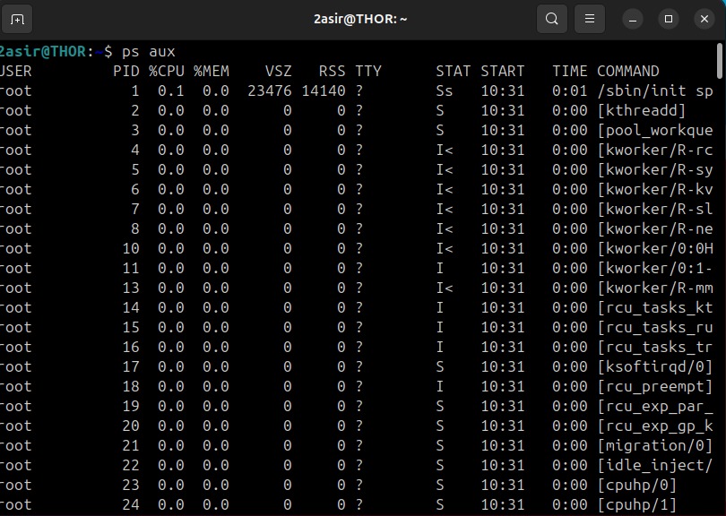
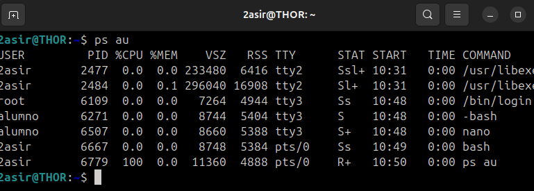
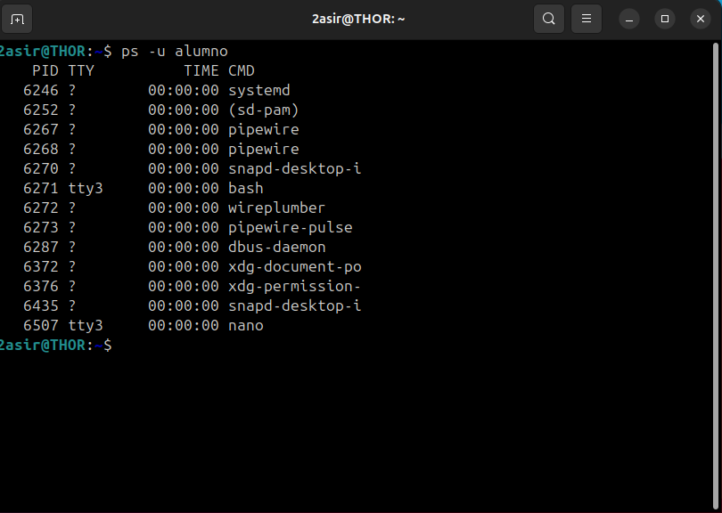
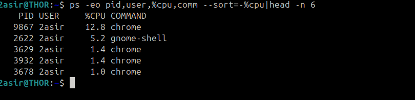
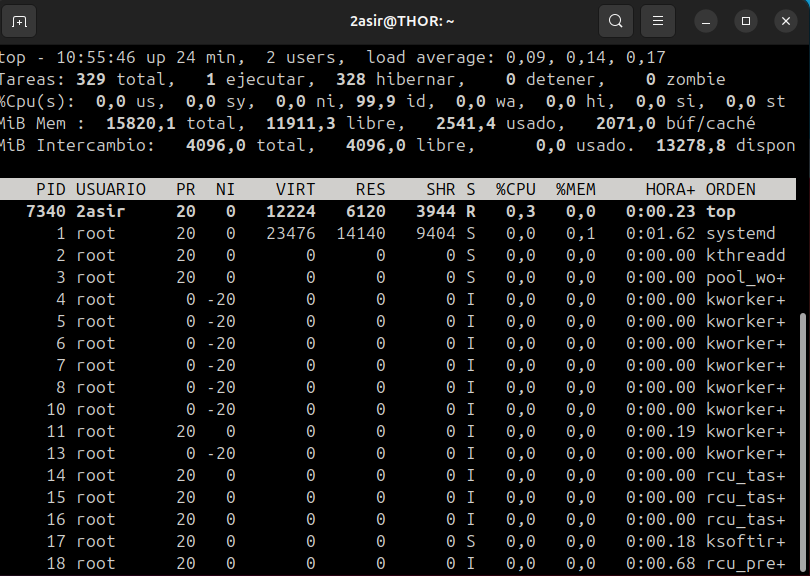
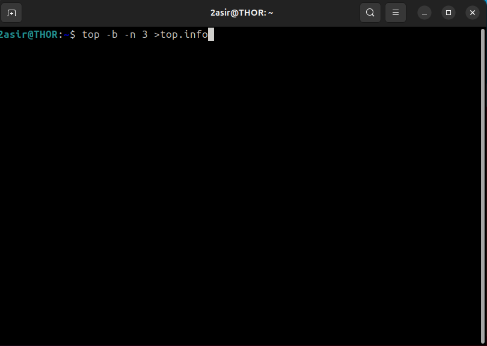
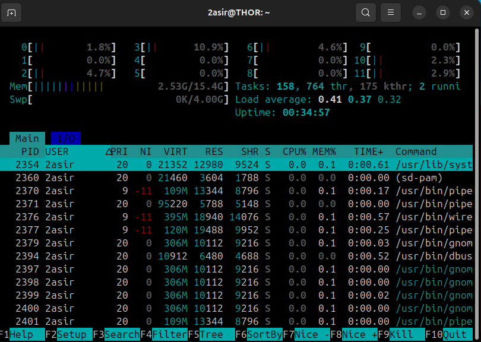
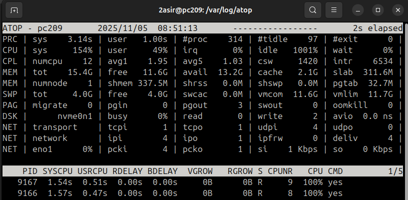

# Monitoreo de Procesos y Rendimiento en Linux

Este documento es una referencia rápida a comandos esenciales para el monitoreo y la gestión de procesos y recursos del sistema (CPU, Memoria, Disco, Red) en entornos Linux.

---

## 1. Comandos de Instantánea de Procesos (`ps`)

El comando `ps` (Process Status) genera una instantánea estática de los procesos activos.

### 1.1. Sintaxis Comunes

| Comando | Descripción | 
| :--- | :--- | 
| **`ps aux`** | Muestra todos los procesos del sistema (`a`: de todos los usuarios, `x`: sin terminal) en formato orientado al usuario (`u`). Es la forma más completa de ver la actividad del sistema. |
| **`ps au`** | Muestra los procesos de todos los usuarios (`a`) en formato de usuario (`u`), pero **excluye** los procesos *daemon* (sin terminal). |
| **`ps -u usuario`** | Filtra y muestra solo los procesos que pertenecen al usuario especificado. |







### 1.2. Identificación de Procesos por Consumo de CPU

Este comando permite identificar rápidamente a los procesos que consumen más CPU:

```bash
ps -eo pid,user,%cpu,comm --sort=-%cpu | head -n 6
```




### Explicación del Comando

```bash
ps -e -o pid,user,%cpu,comm --sort=-%cpu | head -n 6
```

**Descripción de las opciones:**

- **-e:** Selecciona todos los procesos.  
- **-o pid,user,%cpu,comm:** Define un formato de salida personalizado que incluye:
  - `pid`: Identificador del proceso  
  - `user`: Usuario propietario  
  - `%cpu`: Porcentaje de uso de CPU  
  - `comm`: Nombre del comando  
- **--sort=-%cpu:** Ordena la lista de forma descendente (-) por el uso de CPU.  
- **| head -n 6:** Muestra solo las primeras 6 líneas (los 5 procesos principales + la cabecera).

---

## 2. Monitoreo Dinámico (Tiempo Real)

Estas herramientas proporcionan una vista **interactiva y en tiempo real** del estado del sistema.

---

### 2.1. `top` – Monitor Básico de Tareas

`top` muestra un resumen dinámico del sistema (carga promedio, uso de CPU y memoria) y una lista de los procesos en tiempo real.



#### Opciones de Interfaz (Dentro de `top`)

| Opción | Descripción |
|:-------|:-------------|
| **Shift + P** | Clasifica los procesos por el consumo de CPU (%CPU). |
| **Shift + M** | Clasifica los procesos por el consumo de Memoria (%MEM). |
| **Shift + T** | Clasifica los procesos por el tiempo total de CPU consumido (TIME+). |

#### Uso en Modo Batch (No Interactivo)

```bash
top -b -n 3 > top.info
```


**Explicación:**
- **-b:** Ejecuta `top` en modo batch (no interactivo).  
- **-n 3:** Limita las actualizaciones a 3 iteraciones.  
- **> top.info:** Guarda la salida completa en el archivo `top.info`.

---

### 2.2. `htop` – El Monitor Interactivo

`htop` es una alternativa **mejorada, visual e interactiva** de `top`.



**Características principales:**
- Muestra el uso de CPU **por núcleo**.  
- Permite la **gestión de procesos** (Kill, Nice, Filter) mediante teclas de función.  
- Interfaz colorida e intuitiva.

---

### 2.3. `atop` – El Analizador Avanzado

`atop` es un monitor avanzado de rendimiento del sistema.



**Características destacadas:**
- Muestra actividad a nivel de **sistema** (CPU, memoria, paginación).  
- Detalla información a nivel de **proceso**, incluyendo:
  - **DSK:** Actividad de disco  
  - **NET:** Actividad de red  
- Capaz de **registrar la actividad** del sistema para análisis históricos.
