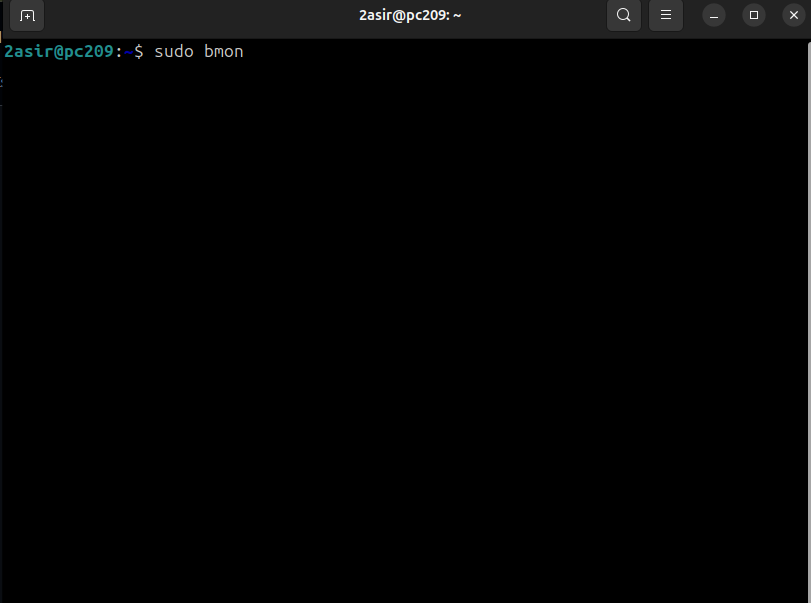
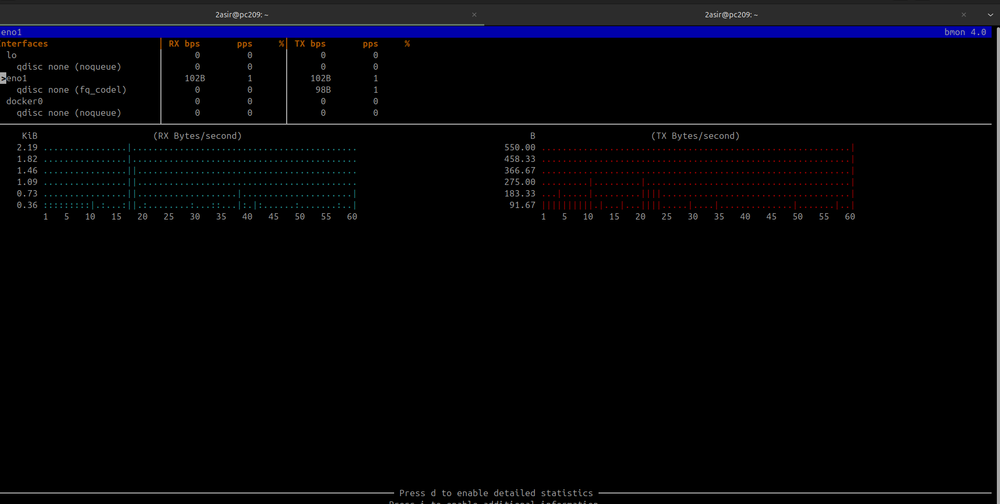
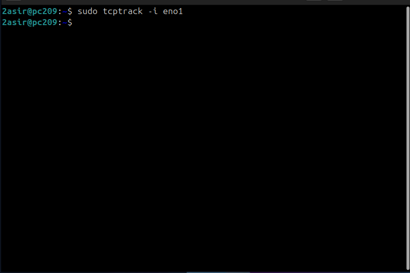
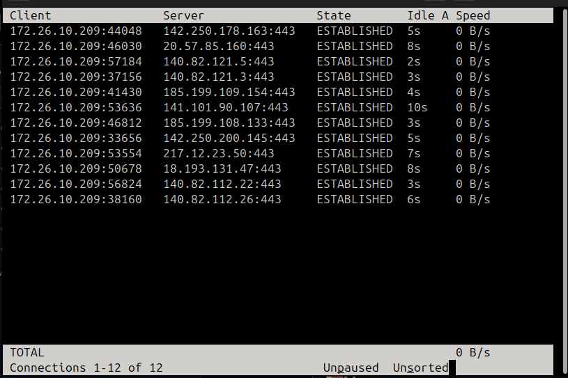
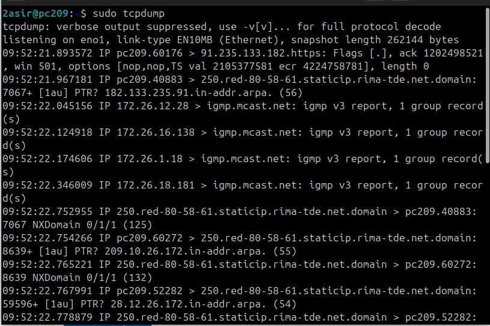

# Monitoreo y Análisis de Tráfico de Red en Linux

Este documento se enfoca en comandos esenciales para el monitoreo de la interfaz, el análisis de tráfico y la inspección de paquetes en una red Linux.

---

## 1. Monitoreo de Ancho de Banda

Estas herramientas ofrecen una vista dinámica del tráfico (bytes y paquetes) que pasa por una interfaz de red.

### 1.1. `bmon` - Monitor de Ancho de Banda

`bmon` (Bandwidth MONitor) es una herramienta simple y eficaz para monitorear el ancho de banda y las tasas de error en las interfaces de red.





| Comando | Descripción |
| :--- | :--- |
| **`sudo bmon`** | Inicia el monitor interactivo. Muestra gráficas de las tasas de recepción (RX) y transmisión (TX) en bytes por segundo. |

### 1.2. `iptraf` - Estadísticas de Red

`iptraf-ng` (IP TRAFfic) es una utilidad de monitoreo de red que proporciona estadísticas detalladas, incluyendo conexiones TCP/UDP, interfaces y actividad general.


| Comando | Descripción |
| :--- | :--- |
| **`sudo iptraf`** | Inicia la interfaz de selección de estadísticas de red. |
| **Vista TCP** | Muestra el tráfico de conexiones **TCP** activas, incluyendo la dirección IP, puerto, número de paquetes, bytes y la interfaz (`Iface`). |

---

## 2. Monitoreo de Conexiones TCP y Análisis de Paquetes

### 2.1. `tcptrack` - Seguimiento de Flujos TCP

`tcptrack` rastrea y muestra información de las conexiones TCP que pasan por una interfaz específica.





```bash
sudo tcptrack -i eno1
```

#### Explicación:

sudo tcptrack: Comando para iniciar el rastreador de conexiones TCP.

- **-i eno1** Especifica la interfaz a monitorear.

#### Salida: La salida lista la IP y puerto del Cliente y Servidor, el Estado de la conexión (ESTABLISHED), el tiempo de inactividad (Idle), y la Velocidad (Speed) en B/s.

### 2.2. tcpdump - Captura y Análisis de Paquetes
tcpdump es una herramienta estándar de análisis de sniffing de red, esencial para la depuración y el análisis de seguridad. Captura y muestra los encabezados de los paquetes que pasan por una interfaz.

```bash
sudo tcpdump
```



#### Salida de Ejemplo: La salida de tcpdump muestra los detalles de los paquetes, incluyendo la marca de tiempo, las direcciones IP de origen y destino, el protocolo, y datos específicos como flags y detalles de DNS/dominios.

